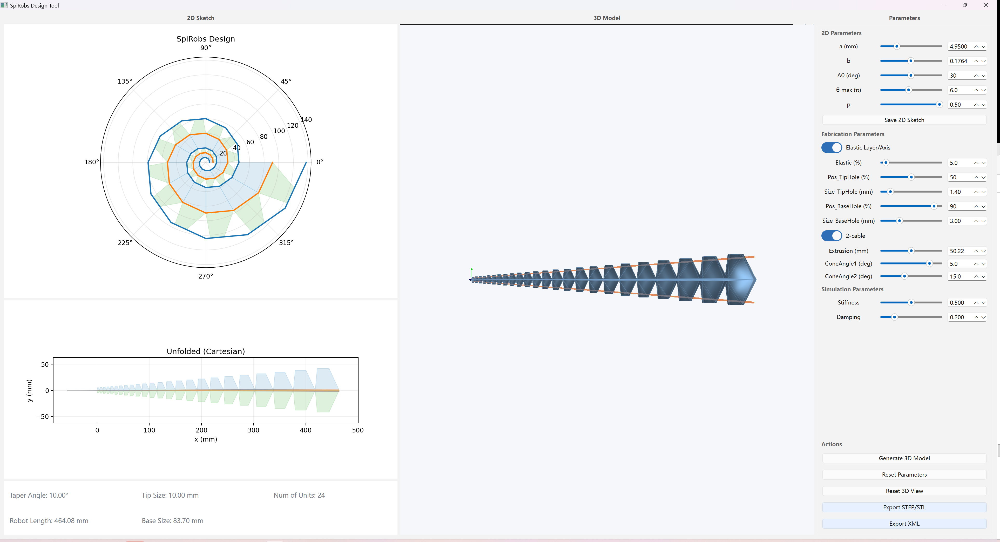
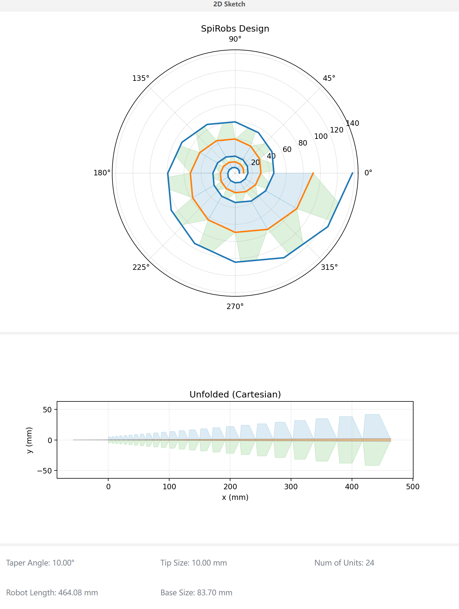
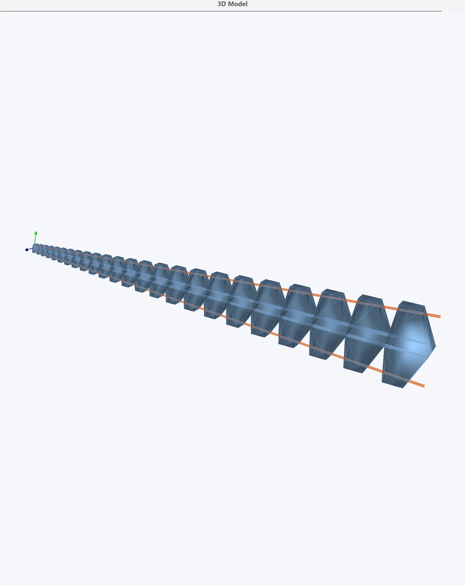
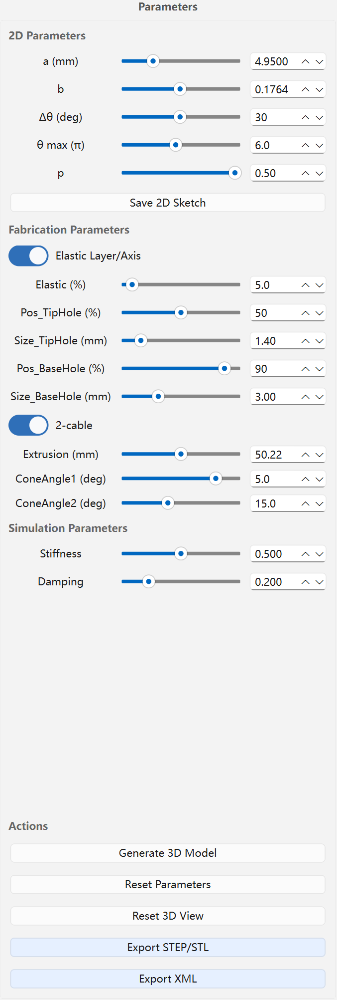

# OpenSpiRobs Design Tool

A GUI tool for designing logarithmic-spiral soft robots (2‑cable / 3‑cable), exporting CAD (STEP/STL) and MuJoCo XML models.

## License
- SPDX: PolyForm-Noncommercial-1.0.0
- Commercial use requires a separate license.

## Requirements
- Python 3.10+ (recommended)
- See `requirements.txt`

Install dependencies:

```bash
python -m pip install -r requirements.txt
```

## Run

```bash
python DesignTool.py
```

---

# User Guide

## 1) Quick Start (Step by Step)
1) Open a terminal and enter the tool folder (use your local path):

```bash
cd "<path-to-your-download>/design-tool"
```

2) Create/activate a virtual environment (recommended). If you already have one, skip this:

```bash
python -m venv .venv
.\.venv\Scripts\Activate.ps1
```

3) Install dependencies:

```bash
python -m pip install -r requirements.txt
```

4) Launch the app:

```bash
python DesignTool.py
```

5) Manual validation (2D / 3D):
- Left panel shows the 2D Sketch
- Drag sliders on the right and confirm the sketch updates
- Click **Generate 3D Model** and verify the 3D view renders

6) Export check:
- **Save 2D Sketch** → PNG/PDF created
- **Export STEP/STL** → STEP/STL created
- **Export XML** → `exports/` contains `robot.xml` + `baselink.stl`

7) Quick export verification:
Check the newest folder under `exports/` contains:
- `baselink.stl`
- `robot.xml`
- STEP/STL file(s)

## 2) Screenshots






---

# Acknowledgements
Thanks to [Haobo Yang](https://github.com/yhbcode000), [Ke Wu](https://mbzuai.ac.ae/study/faculty/ke-wu/) at MBZUAI, and their team for building the parameter visualization system ([SpiRobs](https://aierlab.tech/SpiRobs/)) that inspired this project.

